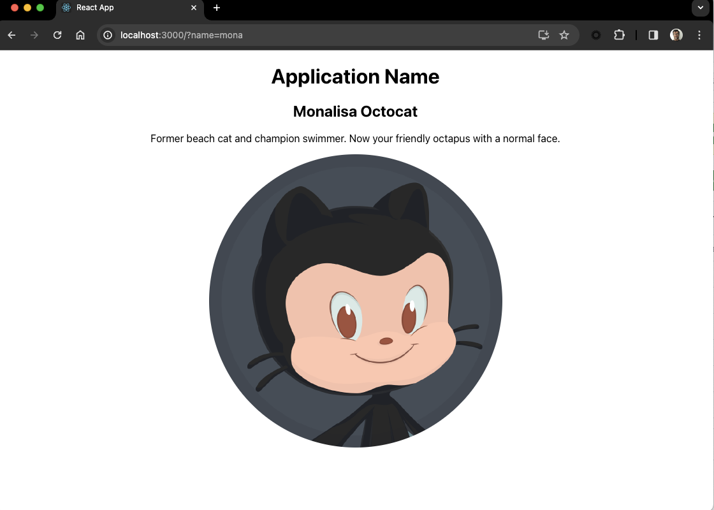

# Adding new style

We have now a React application that allow the user to find a and show a GitHub profile.

Let's add some CSS to make it look better.

## 1 - Create CSSS File for user

Let transform, using Copilot the profile image into a circle, using CSS.


<details>
<summary>Possible Flow</summary>

1. Open Copilot Chat, keeping the `User.js` file open
2. Ask the following question: 
   ```
   @workspace in the User component add a css to round the image, create a class and apply it to the image
   ```

</details>

## Application after these steps

